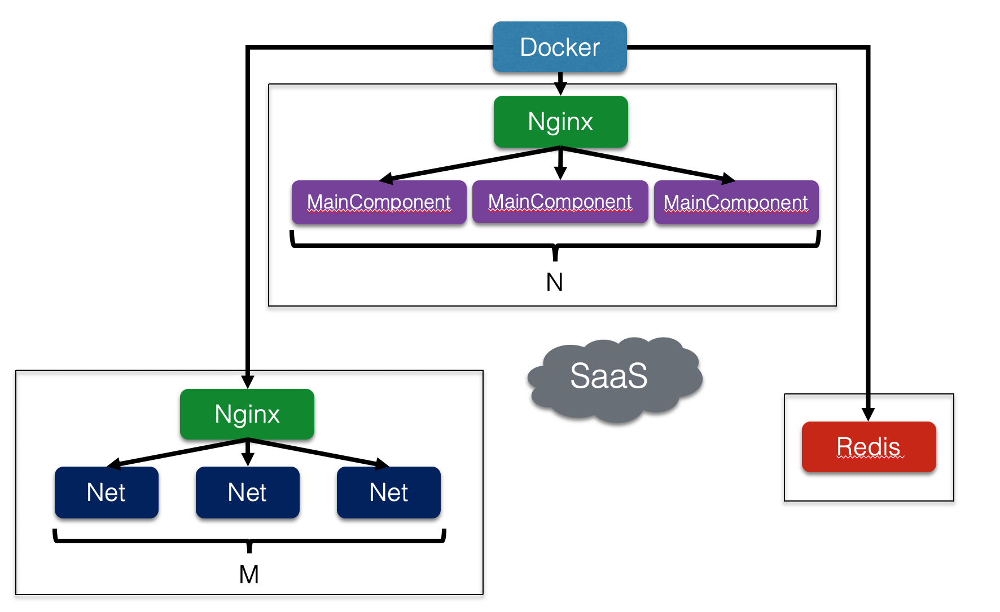

# Ann (Answering neural network)

### Idea
This project is purely educational and was developed during 3rd year of educatian at HSE. SQuAD allows researchers to train strong answering neural models performing even better than human. In this work we tried to combine two strong networks in one model and build cloud service which is aimed to answer user open-domain questions. 

### Details
We used pretrained [BERT-base model](https://arxiv.org/abs/1810.04805) as a feature extractor and [U-Net](https://arxiv.org/abs/1810.06638) as a main network with slight modifications made. We generate predictions for true answer span start/end, plausible answer span start/end and whether the question is answerable. Cloud service offers two options for user: either to provide a document where to search for answer or to use Wikipedia for searching. As for the second option, we use Google API for searching among Wikipedia pages for most relevant, followed by the model predictions generating. 

Cloud application has microservice architecture. One distinct component uses `aitohttp` and `aiowiki` for downloading and parsing Wikipedia pages. Another component is a simple `Flask` server with GPU-enabled neural network set in inference mode.
Finally, we used Redis for caching previously computed answers to improve service latency.

### Schema
The overview of the architecture:

